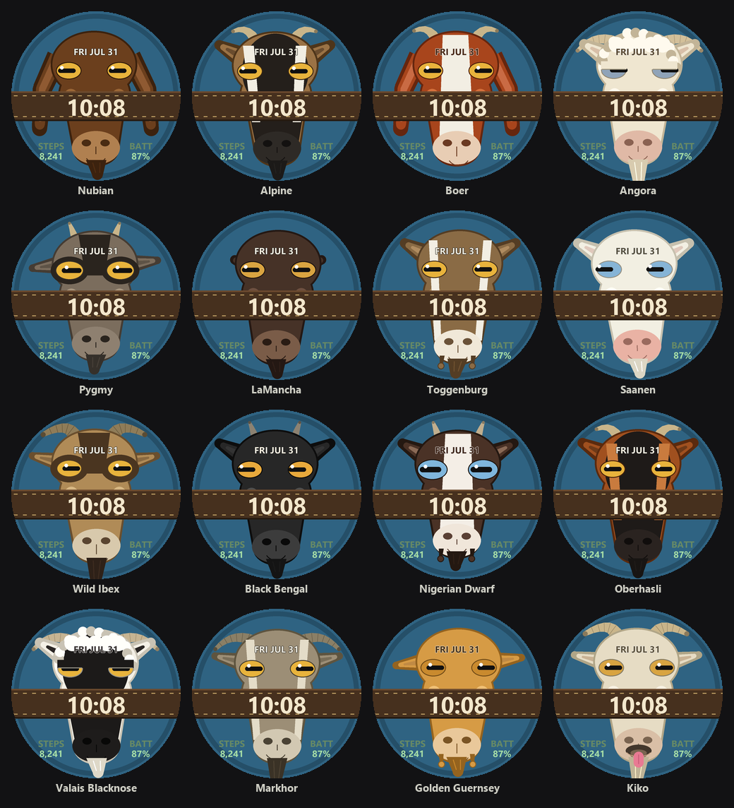
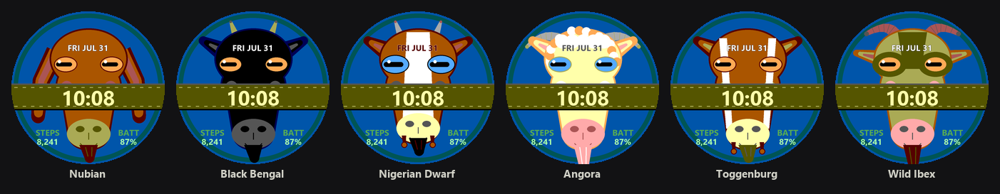

# Goat Face

A Garmin Connect IQ watch face that is a goat looking back at you — and every
second the watch redraws, it moves. It blinks, chews its cud, flicks an ear and
settles it back, glances aside with its head following a beat later, shakes its
head, sticks its pink tongue out, and every so often has a proper yawn. The head
rocks about the neck rather than sliding, so it wiggles in place.

The time is stamped into the leather noseband of its halter; the date is written
across its forehead, and your step goal runs round the rim.

It also takes its mood from you: a low Body Battery slows it down and weighs its
eyelids, and a move bar that has been filling up makes it twitchy.



## The goats

Sixteen breeds, each with its own coat, face markings, ears, horns and beard:

| | | |
|---|---|---|
| **Nubian** — chocolate, ears past the jaw, polled | **Alpine** — black face, white eye stripes, swept horns | **Boer** — rust head, broad white blaze, floppy ears |
| **Angora** — cream ringlets, corkscrew horns, long beard | **Pygmy** — agouti grey, bandit mask, stubby horns | **LaMancha** — the earless one, chocolate, tiny elf ears |
| **Toggenburg** — fawn with two white face stripes | **Saanen** — all white, pink muzzle, pale eyes | **Wild Ibex** — tan, ridged scimitar horns, long beard |
| **Black Bengal** — jet black, amber eyes, short spikes | **Nigerian Dwarf** — chocolate and white, blue eyes, wattles, kid face | **Oberhasli** — bay red under a black mask |
| **Valais Blacknose** — white ringlets, face black to the ears | **Markhor** — wild corkscrew horns, beard to the chest | **Golden Guernsey** — blonde, ears carried low |
| **Kiko** — hardy cream, a big sweep of horn | | |

Pick one in the settings, or leave it on **Surprise me** for a new goat every
hour (or every day).

## Settings

| Setting | Options |
|---|---|
| Goat | Surprise hourly / Surprise daily / any of the sixteen breeds |
| Liveliness | Still, Normal, Frisky — scales all the fidgeting, including off |
| Goat shares your mood | The goat slows and its lids sag on a low Body Battery, and fidgets as your move bar fills |
| Backdrop | Auto (dawn/day/dusk/night), Meadow, Slate, Black |
| Halter strap | On (time on the noseband) / off (bare digits with a shadow) |
| Time colour | Cream, White, Gold, Mint, Sky |
| Just the goat | Hides the date, both fields and the goal ring in one switch; the settings below are remembered |
| Show date | Written across the forehead |
| Bottom left / right | Nothing, Steps, Heart rate, Calories, Battery, Body Battery, Notifications, Distance, Active minutes |
| Step goal ring | Today's progress round the rim |

On a 12-hour watch **AM/PM** is written beside the digits, unless the panel is
too narrow to fit it there without crowding the time.

## Building

Requires the [Connect IQ SDK](https://developer.garmin.com/connect-iq/sdk/) and
a JDK. Point `build_config.json` at both:

```json
{
  "JavaHome": "C:\\Program Files\\Java\\jdk-26.0.1",
  "SdkDir":   "C:\\Users\\you\\AppData\\Roaming\\Garmin\\ConnectIQ\\Sdks\\connectiq-sdk-win-9.2.0-..."
}
```

```powershell
.\build.ps1                       # 454x454 AMOLED (fenix 8 47mm)
.\build.ps1 -Device fr255s -Run   # build a 218x218 MIP panel and run it
.\build.ps1 -Export               # store package, bin\GoatFace.iq
```

`run_simulator.bat` does the build-and-run in one double click.
`savescreenshot.ps1` grabs the simulator's screen into `assets/screen_active.png`
(run it under Windows PowerShell 5.1 — it uses in-box System.Drawing types).

## How it is put together

| | |
|---|---|
| `source/GoatFaceApp.mc` | app shell; reloads settings when they change |
| `source/GoatFaceView.mc` | picks today's goat, poses it, writes the time, date and data fields, and handles always-on mode |
| `source/GoatArtist.mc` | all the drawing |
| `source/Breeds.mc` | the herd — colours and shape switches |
| `source/Pose.mc` | where every part of the goat is *this* second |
| `source/Mood.mc` | how the goat feels about how *you* are doing, sampled every five minutes |
| `source/Config.mc` | cached settings, tolerant of whatever type the settings editor sends |

There is **no bitmap art and no bitmap fonts**. Every feature is laid out in
fractions of `S`, the shorter screen edge, measured from the centre of the
display, which is why one source and resource set covers all 94 supported
products. Filled shapes are kept convex (ellipses, trapezoids, triangles)
because that is what `fillPolygon` is reliable with across the whole device
range, and no method takes more than nine arguments because pre-4.0 devices cap
it there.

The animation has no state. `Pose` is a pure function of the clock, so the goat
picks up mid-fidget no matter when the screen wakes — and a watch face that is
only redrawn once a minute while asleep still shows a different pose each minute.
It comes in two layers: an idle layer always running, and one **gesture** per
five-second bucket chosen by hashing the bucket number. Because a gesture knows
which second of itself it is on, it can have a shape — an ear flicks hard and
settles over three seconds, a yawn opens and closes.

The hash earns its comment. A plain `(n * k + c) % m` is linear enough that
taking it modulo a small number walks a short repeating cycle that can miss
residues entirely; the first version of this face never blinked at all because
of it.

### Colour on MIP watches

Half the supported devices are memory-in-pixel, and the older ones declare a
fixed **64-colour palette**: every channel snaps to `00`/`55`/`AA`/`FF`. There
is no true chocolate in that palette, so a brown goat will always come out
orange-brown or maroon — but what matters is that colours which carry *shape*
stay distinct after quantising. A coat and the halter's leather landing on the
same entry makes the strap vanish into the face, which is exactly what the first
version did.



`tools/check_palette.py` asserts this and fails loudly if a change breaks it:

```
python tools/check_palette.py
```

### Tools

`tools/goatart.py` is a line-for-line PIL mirror of the Monkey C artist — same
fraction constants, same palette, same draw order. **If you change one, change
the other.** It pays for itself three times over:

```
python tools/preview.py       # assets/preview_breeds.png + preview_anim.png
python tools/gen_icons.py     # launcher icons at every panel family's size
python tools/gen_assets.py    # store icon / cover / hero art
python tools/check_palette.py # 64-colour MIP safety + mirror/source agreement
```

Set `goatart.PALETTE64 = True` to render any preview the way a 64-colour MIP
watch would show it — it hooks the colour helpers rather than the output image,
because the device quantises each *fill colour*, not each pixel.

`preview.py` renders all sixteen goats, and twelve consecutive seconds of one goat
across a yawn,
without opening the simulator — the fastest way to see whether a layout change
broke something on a breed you were not looking at.

## Releasing

Push a version tag and `.github/workflows/release.yml` builds the store `.iq`
plus side-loadable `.prg`s and publishes a GitHub release. It needs the
`GARMIN_DEVELOPER_KEY` repository secret (base64 of `developer_key.der`) — see
the comments at the top of that file.

## License

MIT — see [LICENSE](LICENSE).
